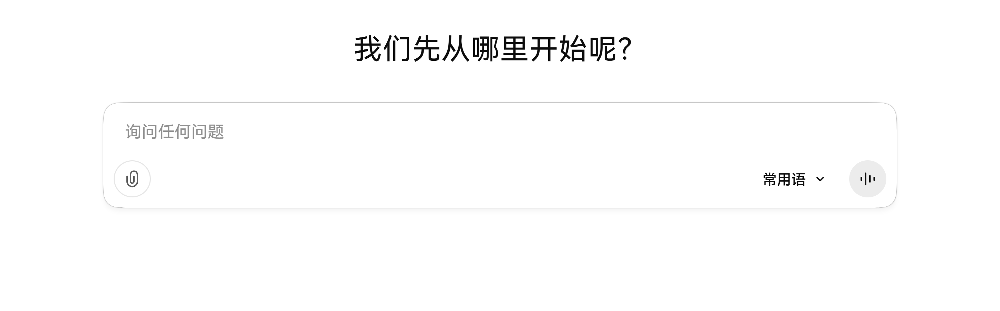
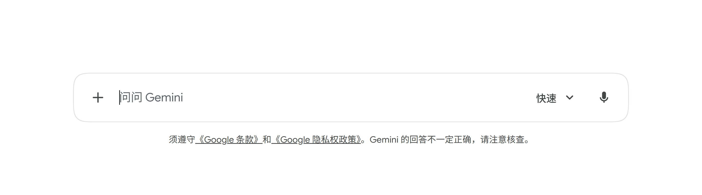
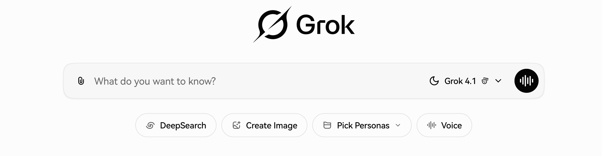
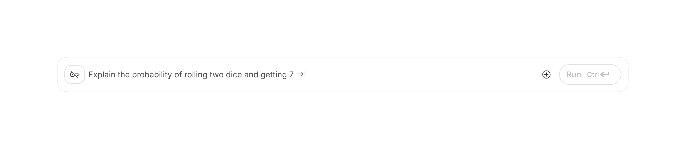

# ChatGPT 脚本

一批用于优化ChatGPT网页端体验的油猴脚本集合。

## 脚本汇总

### 平滑圆角输入框 [chat_squircle.user.js](./chat_squircle.user.js)
- **功能描述**: 为 ChatGPT, Gemini, Grok, AI Studio 等 AI 聊天平台的输入框引入 `corner-shape: squircle` CSS 特性。相比标准的 `border-radius`，它提供了数学上更连续、视觉上更平滑的“超椭圆”圆角（类似 iOS 图标风格）。
- **注意**: 需要浏览器支持实验性 CSS 属性（可能需在 `chrome://flags` 中开启 `Experimental Web Platform features`）。

<table>
  <tr>
    <td align="center">
      <b>ChatGPT</b><br>
      
    </td>
    <td align="center">
      <b>Google Gemini</b><br>
      
    </td>
  </tr>
  <tr>
    <td align="center">
      <b>Grok</b><br>
      
    </td>
    <td align="center">
      <b>Google AI Studio</b><br>
      
    </td>
  </tr>
</table>

### 聊天导航 [chat-navigation.js](./chat-navigation.js)
- **功能描述**: 罗列每个用户、ChatGPT对话，显示在悬浮栏中，方便切换每个对话。
- **更新建议**: 使用当前项目版本


### 使用监控 [usage-monitor.user.js](./usage-monitor.user.js)
- **功能描述**: 记录在当前浏览器使用的模型次数
- **更新建议**: 使用当前项目版本，建议在油猴脚本管理器中禁用自动更新


### 快捷短语 [gpt-shortcuts.user.js](./gpt-shortcuts.user.js)
- **功能描述**: 快速插入预定义短语
- **更新建议**: 使用当前项目版本


## 模型用量分析
获取ChatGPT数据 → 运行分析脚本

### 步骤：
1. 从设置中导出ChatGPT数据
2. 提取 `conversations.json`
3. 运行分析脚本

- 完整历史分析

```bash
python main.py
```

- 最近7天分析  
```bash
python main2.py
```

## 版权说明

当前仓库仅为原脚本的体验优化版本，所有脚本的版权归原作者所有。本仓库提供的脚本基于公开的原始脚本进行体验改进。