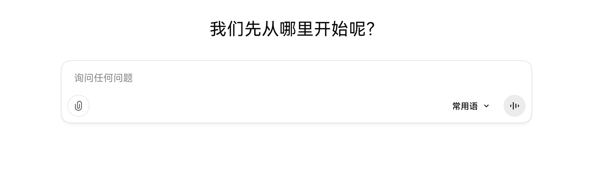
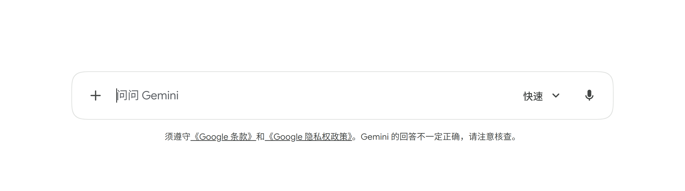
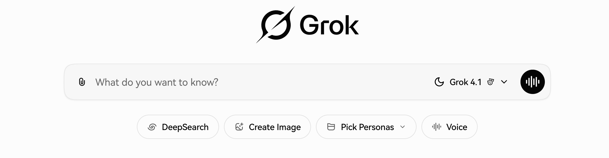
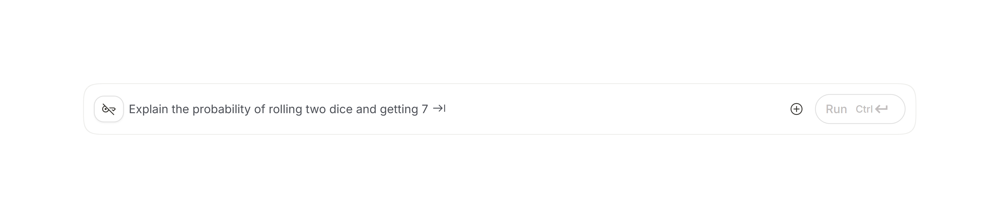
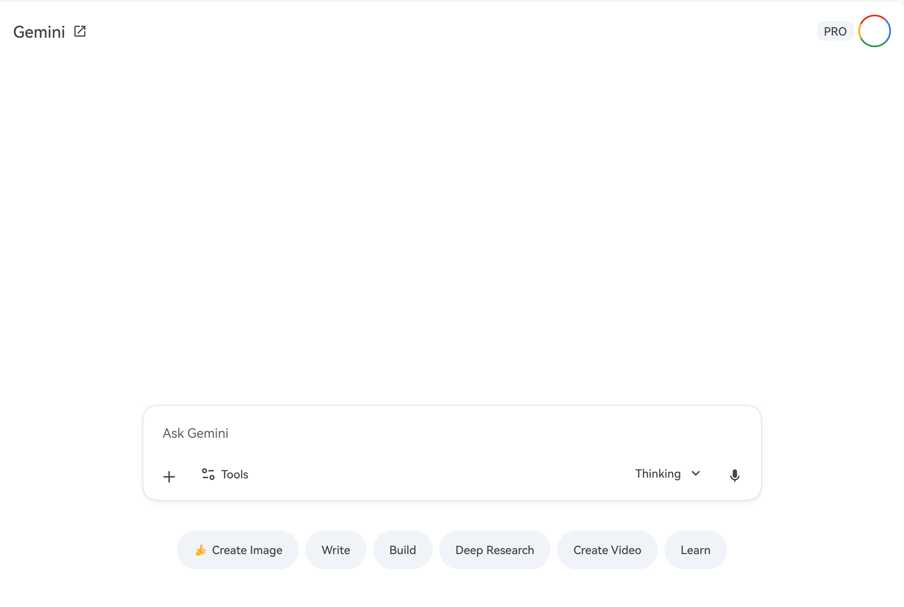
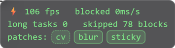

# ChatGPT 脚本

一批用于优化ChatGPT网页端体验的油猴脚本集合。

## 脚本汇总

### ChatGPT 主题 [chatgpt-theme.user.js](./chatgpt-theme.user.js)


> 推荐启用 Edge 浏览器 `edge://settings/appearance` 中的外观设置


### 平滑圆角输入框 [chat_squircle.user.js](./chat_squircle.user.js)

- **功能描述**: 为 ChatGPT, Gemini, Grok, AI Studio 等 AI 聊天平台的输入框引入 `corner-shape: squircle` CSS 特性。相比标准的 `border-radius`，它提供了数学上更连续、视觉上更平滑的“超椭圆”圆角（类似 iOS 图标风格）。
- **注意**: 需要浏览器支持实验性 CSS 属性（可能需在 `chrome://flags` 中开启 `Experimental Web Platform features`）。

<table>
  <tr>
    <td align="center">
      <b>ChatGPT</b><br>
      
    </td>
    <td align="center">
      <b>Google Gemini</b><br>
      
    </td>
  </tr>
  <tr>
    <td align="center">
      <b>Grok</b><br>
      
    </td>
    <td align="center">
      <b>Google AI Studio</b><br>
      
    </td>
  </tr>
</table>

### Gemini 增强 [gemini.user.js](./gemini.user.js)

- **功能描述**: 为 Gemini 添加便捷功能：在 Logo 旁添加"新标签页打开"按钮，同时为输入框应用 squircle 平滑圆角样式。



### 聊天导航 [chat-navigation.js](./chat-navigation.js)

- **功能描述**: 罗列每个用户、ChatGPT对话，显示在悬浮栏中，方便切换每个对话。
- **更新建议**: 使用当前项目版本


### 使用监控 [usage-monitor.user.js](./usage-monitor.user.js)

- **功能描述**: 记录在当前浏览器使用的模型次数
- **更新建议**: 使用当前项目版本，建议在油猴脚本管理器中禁用自动更新


### 快捷短语 [gpt-shortcuts.user.js](./gpt-shortcuts.user.js)

- **功能描述**: 快速插入预定义短语
- **更新建议**: 使用当前项目版本


### 修复 Tooltip 抖动 [chatgpt-tooltip-antijitter.user.js](./chatgpt-tooltip-antijitter.user.js)

- **功能描述**: 修复 ChatGPT 输入框「模型推理等级」「发送按钮」悬停 tooltip 出现后一直闪烁/来回抖动的问题。
- **根因**: ChatGPT 的这些 tooltip 用 CSS Anchor Positioning 定位，但渲染在 composer 内部且 `pointer-events: auto`，与触发按钮产生约 30px 垂直重叠。鼠标悬停时 tooltip 抢占了指针 → Radix 以为指针离开触发按钮而关闭 tooltip → 指针回到按钮 → 重新打开 → 每帧循环抖动。脚本恢复 Radix 默认的 `pointer-events: none`，让指针穿透 tooltip 直达按钮，从而消除循环抖动。

### 长对话滚动加速 [chatgpt-scroll-booster.user.js](./chatgpt-scroll-booster.user.js)

- **功能描述**：让超长会话（几万~十几万 px 高）向上滚动不再卡。核心是给每条消息的 markdown 内容块加 `content-visibility: auto`，并用实测真实高度写 `contain-intrinsic-size`，让屏外内容彻底跳过样式计算、布局和绘制；文档高度异常塌陷时自动回滚。滚动过程中临时关闭顶部导航栏毛玻璃与代码块工具条吸附，停止后自动恢复。
- **HUD**：右下角常驻 FPS / 主线程阻塞面板（⚡ 前缀 + 按帧率颜色分级）；`blur` / `sticky` 两项可点击开关，点击立即生效并写入 localStorage 记住；双击数字区切换精简 / 详细模式。



### 常驻对话 TOC [chatgpt-always-toc.user.js](./chatgpt-always-toc.user.js)

- **功能描述**：让 ChatGPT 右缘的会话 TOC（竖排刻度条，悬停展开全部提问、点击跳转）在**任何对话里常驻显示**。原生实现只在提问数达到阈值的长对话才渲染，且挂载时机不稳定（同一长对话刷新后滚动也未必出现）；短对话则完全不渲染。脚本自建一个外观与原生一致的 TOC 补齐缺口，原生挂载后自动让位、卸载后自动接管。
- **原生实现结构**（逆向，2026-08）

  | 部件 | 结构 |
  | --- | --- |
  | 悬浮容器 | `div.fixed.inset-e-4.top-1/2.z-20`（右缘居中 fixed） |
  | 刻度条 | 每条用户提问一个 2×18px 圆角刻度 `button[data-toc-item-index]`，当前提问带 `data-toc-active` |
  | 悬停面板 | `div.popover`（圆角卡片 + 阴影），列出全部提问文本，单行截断，当前项高亮 |
  | 数据源 | 线程骨架 `div[class*="convSearchResultHighlightRoot"]` 下的 `[data-turn-id-container]` 占位，**每个 turn 一个、虚拟化时也常驻**；用户提问在奇数索引（首位的 `client-created-root` 是不挂载内容的幻影容器），提问文本取自已挂载的 `section[data-turn="user"]` |

- **脚本要点**
  - 刻度/列表点击平滑跳转：长距离直接 `scrollTop`（`behavior:'smooth'` 会被 ChatGPT 的滚动管理立即取消），短距离 rAF 补间；跳转后 2 秒内多次重申目标位置，对抗应用把滚动位置拉回旧锚点的行为，用户一有滚轮/触摸/按键输入立即放弃。
  - 虚拟化长对话里未挂载的提问先以 "Prompt N" 兜底，section 挂载后自动回填真实文本。
  - 高亮同步在滚动时只做一次子节点遍历（rAF 节流），不与滚动加速脚本抢主线程。
  - 样式全部走 ChatGPT 主题变量（`--text-primary` / `--text-tertiary` / `--main-surface-primary`），深浅色主题自动跟随。


### Token 生成速度 [chatgpt-token-speed.user.js](./chatgpt-token-speed.user.js)

- **功能描述**：拦截会话 API 响应流，计算并显示 token 生成速度；token 数使用网页内置的 o200k Tiktoken 精确计算，加载失败时退回字符估算。


## 模型用量分析

获取ChatGPT数据 → 运行分析脚本

### 步骤

1. 从设置中导出ChatGPT数据
2. 提取 `conversations.json`
3. 运行分析脚本

- 完整历史分析

```bash
python main.py
```

- 最近7天分析  

```bash
python main2.py
```

## 版权说明

当前仓库仅为原脚本的体验优化版本，所有脚本的版权归原作者所有。本仓库提供的脚本基于公开的原始脚本进行体验改进。
